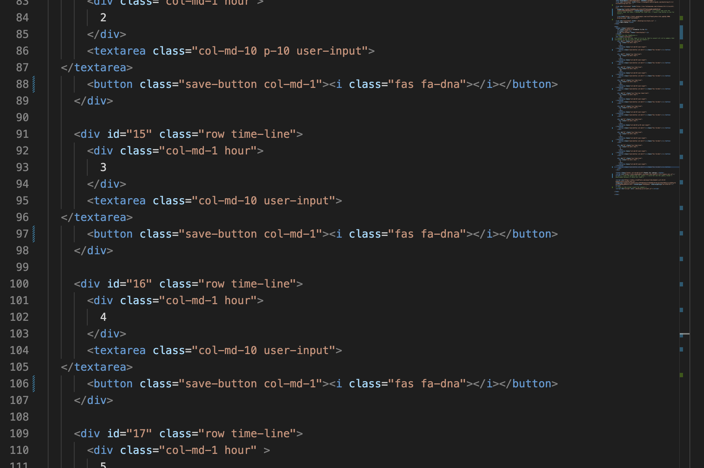

# Scheduler is on

## Used starter code to complete a functioning work day at a glace calendar

The application functions by storing user input in the local storage in the web page to be viewed again. The button needs to function as the lock or set storage click. I created my entire code with html and used JQuery. I feel more comfortable with JQuery, the syntax is easier for me to understand. Here is the link to my [deployed page](https://katsaymeow.github.io/work-day-at-a-glance/).

****

## Steps I took for this assignmnet

I knew from last week I needed to change my process up again. I cloned the repo this time, but I still added that code to my own files. I think that was still a 'fork'.

I decided to just type out what I knew I needed without research. I began knowing I wanted to use JQuery after javascript through me for a loop. I found a [JQuery cheatsheet](https://htmlcheatsheet.com/jquery/) that helped me. I used their script add on and got lost with that. So I then downloaded a JQuery file to attach, and that also did not work. I ended up using a google api for JQuery because every other way I tried was logging errors on the JQuery links. I think my issue was replacing the orginal one. 

****

***

I knew I needed to start with loading the JQuery and defining time and text. I set moment to respond by the hour after I set the format to display in the provided jumbotron. The save button function needed to load first so I started there. I needed functionality to work so I could figure out how to write the HTML. I new I needed to use this so I could select multiple elements at once for my timeblocks. I read about that for a while first. I wrote one timeblock in HTML just to make sure I liked the style and it was close to the mock up.

****

*****

I went old school this week with my note taking. I wrote everything out to reference. I spent less time reading about how to make code and just typed it as I went. I change it over and over until I realized it was my JQuery link not functioning. 

****

****

I only had to change a few things in the  CSS from what was provided. I had already named my var at this point and just changed them in the CSS. I learned more about using padding from the supplied CSS. I also really like Bootstrap. I was easy to tweek what I wanted in the HTML. 

****

***

I was really stuck getting my time to work with the CSS. I kept changing and adding until my tutor appointment. My tutor helped me come up with parseInt(). I am still unsure it's total function, but I understand it is taking my timeblock string values and converting them to intergers to be read by moment(). I really thought I still needed another function that would write the value of the if, else to the timeblocks. This was accomplished by using the 24 hour time string value! I was in shock durning my tutoring that it was all I needed. 

***

### Conclusion

I have not finished a code without help. I know as I am learning, this is normal. I still can not stop thinking about that. I really need to focus on more javascript, as I spent this week trying to do anything but that. I am going to try to complete next weeks homework with out JQuery, which I feel is I am using as a crutch for learning javascript. I was really easy to accomplish in one line what takes 3 or 4 though. I really was typing "I want this to do this to that" and felt really good when it resemlbed what I was going for on the deployed page. In the end, I was still shocked at how much code was actually required. I am going to spend the week catching up with some javascript tutorials since I am not yet ready to revisit last weeks homework just yet. 

***
## Sources

[document.ready()](https://learn.jquery.com/using-jquery-core/document-ready/)

[moment library](https://cdnjs.com/libraries/moment.js/2.24.0)

[displaying moment](https://momentjs.com/docs/#/displaying/)

[using icons](https://www.w3schools.com/iconsicons_reference.asp)

[JQuery cheatsheet](https://htmlcheatsheet.com/jquery/)

[remove class](https://api.jqueryui.com/removeClass/)

[add class](https://api.jqueryui.com/addClass/)

[this mdn](https://developer.mozilla.org/en-US/docs/Web/JavaScript/Reference/Operators/this)

[this research](https://stackoverflow.com/questions/59349232/)

[understanding $()](https://learn.jquery.com/using-jquery-core/dollar-object-vs-function/)

[local storage](https://stackoverflow.com/questions/40791207/setting-and-getting-localstorage-with-jquery)

[parseInt](https://developer.mozilla.org/en-US/docs/Web/JavaScript/Reference/Global_Objects/parseInt)
